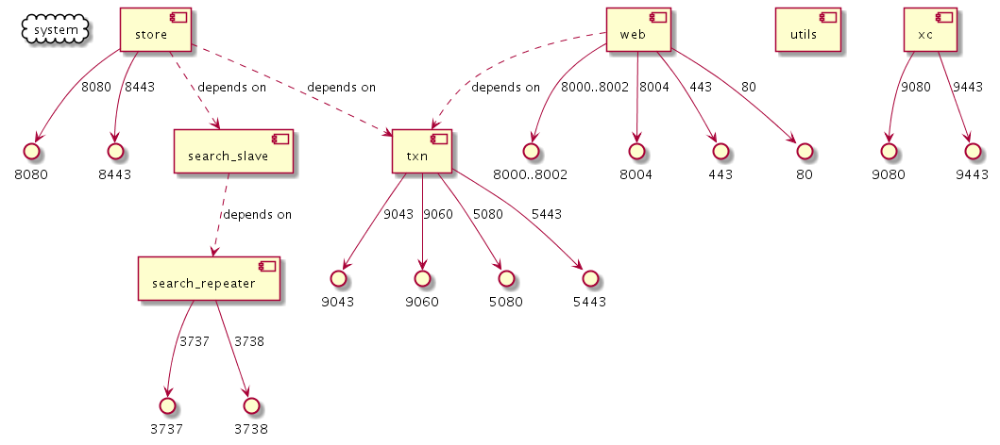

# docker-compose-to-png
Bash script that generates a diagram of the docker compose service dependencies (depends-on) and their exposed ports

Requires docker.

Takes two params: path-to-docker-compose-file and optional [output-png-file]

Based on:

- funkwerk/compose_plantuml <https://hub.docker.com/r/funkwerk/compose_plantuml>
- think/plantuml <https://hub.docker.com/r/think/plantuml/>

Example image from yml: <https://www.ibm.com/support/knowledgecenter/en/SSZLC2_9.0.0/com.ibm.commerce.install.doc/code/docker-compose-live-extdb.yml>
